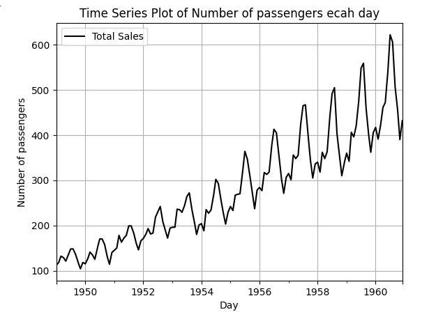

## Devloped by: SANJAY A
## Register Number: 212224040288
##  Date: 11-03-2025

# Ex.No: 01A PLOT A TIME SERIES DATA


# AIM:
To Develop a python program to Plot a time series data with respect to time.

# ALGORITHM:
1. Import the required packages like pandas and matplot
2. Read the dataset using the pandas
3. Convert date column into datetime datatype and set it as index.
4. Resamples all the Passengers in a day using interploate() and plot the Total number of passengers per day
5. Add the necessary details to the plot and display the graph.

# PROGRAM:
```py

from matplotlib import pyplot as plt
import pandas as pd

df=pd.read_csv("/content/test.csv")

df.head()

df['Month']=pd.to_datetime(df['Month'])

df.dtypes

df.set_index('Month',inplace=True)

df_resampled = df['#Passengers'].resample('D').interpolate()
df_resampled.plot(kind='line',label='Total Sales', color='black')
plt.title('Time Series Plot of Number of passengers ecah day')
plt.xlabel('Day')
plt.ylabel('Number of passengers')
plt.legend()
plt.grid(True)
plt.show()
```

# OUTPUT:



# RESULT:
Thus we have created the python code for plotting the time series of given data.

# Interpretation:

This is a Non stationary time series with Multiplicative Seasonality and Additive Trend
